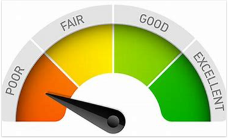

# 17Credit_Risk_Analysis

## Overview Of Analysis

Jill, the Lead Data Scientist from FastLending has asked me to partner with her on a project designed to designed to apply machine learning to predict credit lending risk. We will work together analyzing a credit card dataset from LendingClub, a peer-to-peer lending services company.

## Results

In the same way that finances poorly managed can lead to a poor credit rating, time poorly managed can lead to incomplete homework at time of deadline.  How fortunate for both instances, that people are given the opportunity to improve over time.  Better consult with some experts!